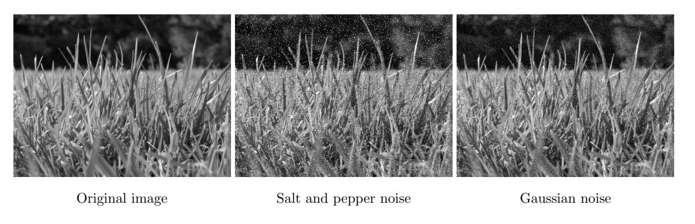
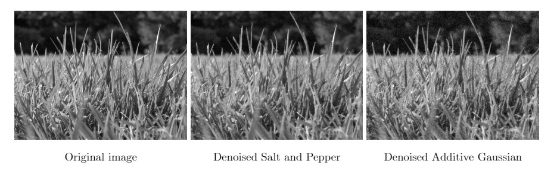

# Image_Noise
A short script for examing different images noises and filtering methods.

The functions are contained in 'myPSNR.py' and 'denoise.py'. 

The calculations and visualizations of results are contained in 'visualize_calculate.py'.

## Overview

Two different types of image noise are used; Salt and Pepper noise, and Additive Gaussian noise. 

**Salt and pepper noise** is also known as impulse noise and results in pixels in the image being randomly replaced by either a white or a black pixel.

**Additive Gaussian noise** results in every pixel in the image having a noise component that corresponds to a random value chosen independently from the same Gaussian probability distribution with a mean of zero and certain standard deviation

=\mathbf{I}(x)%2B\epsilon,%20\text{where},%20\epsilon\sim\mathcal{N}\left(0,\sigma^{2}\right))

Three filtering methods, with varying parameter settings, are used to denoise the images.

**Box filtering**, also called moving average filter, is a linear filter. This means that the value of an output pixel is determined as a weighted sum of the input pixel values within a certain neighbourhood. The window that is used to calculate the weighted sum is determined by the kernel size (a K by K window). The box filter simply averages the pixel values in this K by K window, meaning that it makes use of a flat kernel. The larger the kernel size, the more pixel are used to calculate an output pixel's value.

**Median filtering** is a non-linear filtering technique. Instead of taking the average of the neighbouring pixels in a K by K window, as is done in box filtering, it takes the median as the output pixel's value.

**Gaussian filtering** is a non-linear filtering technique where a two dimensional Gaussian function is used to generate a kernel. It results in a bell shaped figure, meaning that it gives kernel coefficients that diminish with increasing distance from the kernel's center. The standard deviation (sigma) determines the width of the bell.

The peak signal-to-noise-ratio (PSNR) is used as a metric for evaluation the performance of the image enhancements. 

